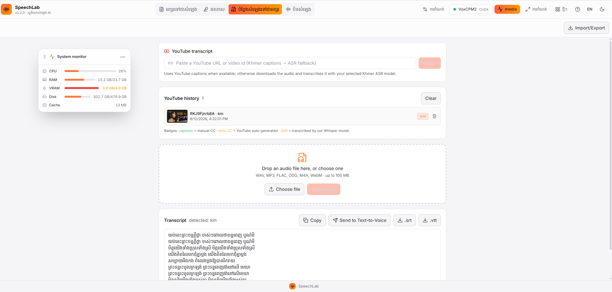

# SpeechLab — AI Voice Studio (Khmer)



A fully-offline, local web studio for **multiple open-source TTS and speech-to-text
engines**, tuned end-to-end for **Khmer (ភាសាខ្មែរ)** — plus podcast editing, video
dubbing, YouTube transcription, offline translation, and more.

Built as a fork of [Voice Studio by Neural Collective](https://github.com/im4tta),
rebranded **SpeechLab** and extended with a Khmer-first experience: a nanovllm-powered
VoxCPM2 engine, Khmer-tuned speech-to-text with spell-correction and word segmentation,
and a YouTube scribe that transcribes videos (captions or ASR) with history.

> Current version: **1.2.0**. Everything runs on your machine — no cloud, no telemetry.

---

## Highlights

- **8 TTS engines, switchable in the UI** (only one loads at a time to keep memory low):
  | Engine | Notes |
  |---|---|
  | **VoxCPM2 · Khmer** (`nanovllm_km`, default) | 2B tokenizer-free TTS tuned for Khmer: spoken-form normalization (numbers glued to words, ៗ, dates, times, money, units, phone numbers), cluster-safe chunking, one consistent voice across chunks, seamless joins. Concurrent batching via [nano-vllm-voxcpm](https://github.com/a710128/nanovllm-voxcpm) on NVIDIA GPUs; **runs on Apple Silicon, CPU and small GPUs** via the reference VoxCPM2 runtime. |
  | **VoxCPM2** (`voxcpm`) | Same checkpoint on the reference PyTorch runtime; **auto CPU-offload** on GPUs < 7.5 GB so it still works (slowly) on small cards. |
  | **VibeVoice-1.5B** | Microsoft's voice-cloning model, up to 4 speakers. |
  | **Kokoro-82M** | Fast, lightweight, built-in voices. |
  | **Kitten TTS Mini** | ~80M ONNX — runs on anything, even pure CPU. |
  | **Chatterbox V3** | Zero-shot cloning, 23 languages. |
  | **OmniVoice** | Clone / Design / Auto voice modes, 600+ languages. |
  | **Qwen3-TTS CustomVoice** | 9 premium voices + free-text style + advanced sampling. |
- **Speech-to-text with Khmer-first models** — Whisper plus **9 Khmer-tuned checkpoints**
  (seanghay, 1morecupofhottea, ksoky, steja, ken0997…), pickable in the Transcribe
  settings. Output runs through a **Khmer spell-corrector + CRF word segmenter** (ported
  from the KhmerScribe tool).
- **YouTube scribe** — paste a YouTube URL; fetches captions (Khmer → English), or falls
  back to downloading the audio and transcribing with your chosen ASR model. History with
  source badges (**manual captions / auto CC / ASR**) and **manual correction** that never
  loses the original.
- **Four modes** — multi-segment **Podcast** editor · single-textarea **Text-to-Voice**
  (with text history to re-run any past text with another voice) · **Transcribe** (audio →
  editable transcript → `.srt`/`.vtt`) · **Dub** (audio → re-voice in any voice, same- or
  cross-language).
- **Offline translation** — M2M-100 (418M / 1.2B) and Argos Translate, all in-process.
- **Live synthesis progress**, **hardware recommendations** for your GPU, a **movable
  system monitor widget**, and full-page **Controls / Recent generations** views.

---

## Quick start

### Prerequisites

- **Python 3.10+** (3.11 tested; some engines need 3.10–3.12)
- **Node.js 18+**
- **Disk** for model weights (auto-downloaded on first use): Kitten ~79 MB · Kokoro
  ~350 MB · Whisper ~1.6 GB · VoxCPM2 ~5 GB · VibeVoice ~5.4 GB · Qwen ~3.5 GB …
- **GPU optional.** NVIDIA (CUDA ≥ 12.6, RTX 30xx+ with 6 GB+) gets the fast concurrent
  Khmer path; **Apple Silicon Macs use the GPU via MPS**; everything else runs on CPU.
- **`ffmpeg`** (some audio I/O, and YouTube audio) and **`yt-dlp`** (YouTube scribe).
  `python studio.py setup` checks for them and prints the install command for your OS.

### Setup & run

```bash
python studio.py setup          # one-time: venv, GPU-matched PyTorch, deps, npm, model picker
python studio.py start          # backend (:8880) + frontend, together
python studio.py start --dev    # force dev (Vite :5173, hot reload)
python studio.py start --prod   # build the UI and serve everything on :8880
python studio.py models         # re-open the model picker
```

Open <http://localhost:5173> (dev) or <http://localhost:8880> (prod).

`studio.py` is stdlib-only and is the recommended path. Manual alternative: see
`backend/` for the FastAPI app (`python -m backend.cli --help`) and `frontend/` for the
React/Vite app (`cd frontend && npm install && npm run dev`).

### Khmer engine (nanovllm_km)

Install from the app (engine menu → **Install**) or:

```bash
python studio.py install-nanovllm     # picks the right runtime for this machine
```

The installer detects your hardware and installs one of two runtimes (force one with
`NANOVLLM_INSTALL_PROFILE=full|lite`):

| Machine | Runtime | How long text is generated |
| --- | --- | --- |
| NVIDIA RTX 30xx/40xx/50xx, A-series… with **≥ 6 GB** and a CUDA 12.6+ driver | **full**: nano-vllm-voxcpm + reference fallback | chunks **in parallel**; pool sized to your VRAM (20 GB+ / 12 GB+ / 8 GB+ / 6 GB tiers, stepping down automatically if a load runs out of memory) |
| **Apple Silicon Mac** (M1–M4) | **lite**: reference VoxCPM2 on **MPS** (float32) | one chunk at a time |
| Older NVIDIA (GTX 16xx, RTX 20xx, T4 — no flash-attn) or < 6 GB | **lite**: reference VoxCPM2 on CUDA (≥ 7.5 GB) or CPU | one chunk at a time |
| No GPU | **lite**: reference VoxCPM2 on CPU | one chunk at a time (slow) |

Both runtimes share the same Khmer pipeline, so output quality is the same; only speed
differs. The engine picks at load time and reports the runtime + device in the UI.

- The full profile needs **flash-attn**, which usually isn't on PyPI. If it's missing the
  engine **still works** on the reference runtime; for the parallel fast path install a
  prebuilt wheel matching your torch/CUDA/Python into `backend/venv-nanovllm`.
- First load downloads the VoxCPM2 checkpoint (~5 GB); on nanovllm it also compiles CUDA
  graphs (minutes; skipped on ≤ 8 GB cards to save VRAM).
- Tuning (`backend/.env`): `NANOVLLM_BACKEND=auto|nanovllm|reference`,
  `NANOVLLM_MAX_NUM_SEQS`, `NANOVLLM_GPU_MEMORY_UTILIZATION`, `NANOVLLM_MAX_MODEL_LEN`,
  `NANOVLLM_ENFORCE_EAGER`, `NANOVLLM_CHUNK_MAX_CHARS` — leave the sizing ones unset to
  auto-size from VRAM.

**Mac quick start:** `python3 studio.py setup` (installs the MPS-enabled PyTorch), then
`python3 studio.py install-nanovllm` and `python3 studio.py start`. A 16 GB+ Mac is
comfortable for the 2B model; on 8 GB close other apps first.

**Khmer text tips.** You can type naturally — `ឆ្នាំ២០២៤`, `$12.50`, `10,000៛`, `8:30`,
`012 345 678`, `ផ្សេងៗ`, `។ល។` are all spoken correctly. Start the text with `(style)` —
e.g. `(សំឡេងស្ត្រី ស្ងប់ស្ងាត់)` — to apply a voice style to the whole passage.

The plain **VoxCPM2** (`voxcpm`) engine runs the same Khmer pipeline on the reference
runtime too, and either engine can load from a local model folder:

```bash
python studio.py start --voxcpm-model-path "C:\path\to\your\VoxCPM2"
# or set VOXCPM_MODEL_PATH in backend/.env, or in the app: Controls → Local VoxCPM2 folder
```

### Khmer speech-to-text

Transcribe → **Settings** → pick a Khmer model (recommended: `seanghay/whisper-small-khmer-v2`).
Khmer output is automatically **spell-corrected** against a ~34k-word dictionary and
**word-segmented**. For songs/lyrics, expect any ASR (ours or auto-CC) to struggle —
use the **Correct** button to paste verified text.

### YouTube scribe

In Transcribe mode, paste a URL and hit **Fetch**. It returns captions (with a
**captions / auto CC / ASR** badge) or falls back to ASR, keeps a **history**, and lets
you **Re-transcribe (ASR)** or paste **Correct** lyrics (the original is preserved).

---

## Adding voices

- **Drop-in built-in voices**: put a mono `.wav` / `.mp3` / `.flac` / `.ogg` clip
  (1–60 s) into `backend/voices/`; the filename stem becomes the voice id. Optional
  metadata in `backend/voices/voices.json` (`{"en_Amelia": {"name":"Amelia","gender":"woman","language":"en"}}`).
  Restart the backend.
- **Upload from the UI**: the voice picker (top-right) → **+** → pick a clip → name /
  gender / language → **Upload**.
- Edit any voice's name/gender/language/reference-transcript with the pencil icon.

## Cache

Synthesis results are cached on disk keyed by text + voice + settings + engine.
Re-running identical inputs replays the cached WAV instantly; **Regenerate** forces a
fresh take. Browse/clear from **Controls → Recent generations**.

## API

Base URL `http://localhost:8880/api`. Main routes:

| Method | Path | Description |
|---|---|---|
| `GET` | `/health` · `/config` | Liveness + app/runtime config |
| `GET` | `/engines` | Engines + capabilities + installed/downloaded flags |
| `POST` | `/engines/activate` | Switch engine `{name}` |
| `GET/POST` | `/engines/{name}/install` `/download` `/delete-weights` `/uninstall` | Isolated-env / weights management with live progress |
| `GET` | `/voices` · `POST` `/voices/upload` · `POST` `/voices/{id}/meta` · `DELETE` `/voices/{id}` | Voice library |
| `POST` | `/synthesize` | TTS → `audio/wav` (or `?response_format=base64`) |
| `POST` | `/download` | Join multi-segment WAV |
| `GET/DELETE` | `/cache` · `/cache/{hash}` | Synthesis cache |
| `GET` | `/asr/status` | ASR status + **model catalog** (Khmer options) |
| `POST` | `/asr/model` | Activate an ASR model (downloads on demand) |
| `POST` | `/asr/transcribe` | Transcribe an uploaded file or cached audio |
| `GET` | `/synthesis/progress` | Live progress of the in-flight synthesis |
| `POST` | `/youtube/transcript` | YouTube scribe: captions or ASR (`force_asr` to skip captions) |
| `POST` | `/youtube/transcript/correct` | Save a manually-corrected transcript (original preserved) |
| `GET/DELETE` | `/youtube/history` · `/youtube/history/{id}` | YouTube transcript history |
| `GET` | `/youtube/audio/{id}` | Download (cached) video audio as WAV |
| `GET/POST` | `/translate/status` `/translate/activate` `/translate` | Offline translation |

## Notes & gotchas

- **One engine loads at a time**; the choice persists (`backend/.last_engine`).
- **Concurrent synthesis serializes** on a single GPU lock.
- **Windows**: install a CUDA-matched PyTorch wheel before `pip install -r backend/requirements.txt`,
  or CUDA silently falls back to CPU.
- **Small GPUs**: `nanovllm_km` auto-sizes nanovllm for 6–8 GB cards; below that (or on
  pre-Ampere cards) it and VoxCPM2 run the 2B model on CPU. Kokoro / Kitten / VibeVoice
  (fp16) fit smaller cards — the app's **hardware recommendations** panel tells you what
  fits your GPU (or your Mac's unified memory).
- **macOS / Apple Silicon**: every engine uses the Apple GPU via MPS (`--device auto`,
  the default); ops MPS doesn't implement yet fall back to CPU automatically
  (`PYTORCH_ENABLE_MPS_FALLBACK=1` is set for you).
- **espeak-ng** is required by Kokoro (silent audio without it); **ffmpeg** + **yt-dlp**
  are required for the YouTube scribe audio path.

## Development

```bash
cd backend && python -m pytest tests/        # smoke tests, no weights needed
cd frontend && npm run typecheck && npm run build
```

## Credits

Built with assistance from an AI coding agent; human review and local testing gate every
change. Model/engine developers, the Khmer ASR fine-tune authors, font designers
(Danh Hong for Hanuman/Battambang/Moul, Rasmus Andersson for Inter), the original
**Voice Studio** (im4tta) and the **voxkhtts** Khmer TTS Studio are credited in-app
(**?** button in the header) and in `CLAUDE.md`.

## License

**MIT** for the code in this repo — see [LICENSE](LICENSE). Each bundled engine keeps its
own license and model-usage policy; review them before redistributing generated audio.
Model weights and cloned voice assets retain their original provenance.
